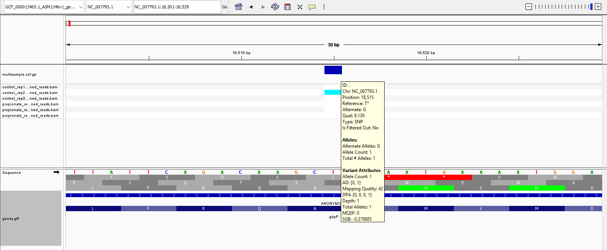
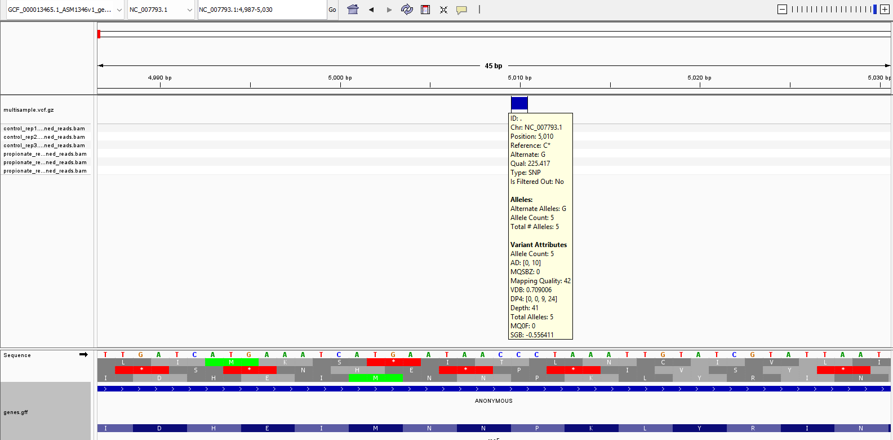
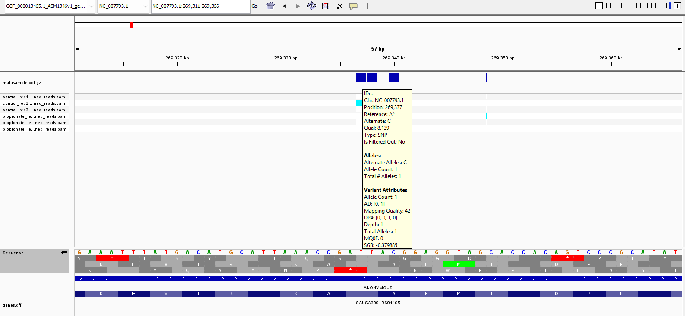
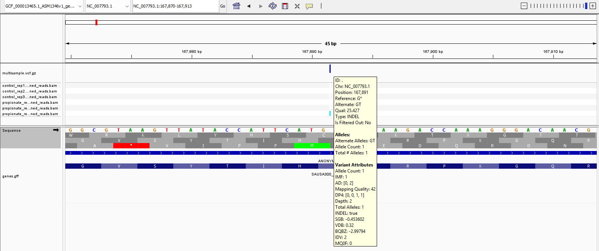
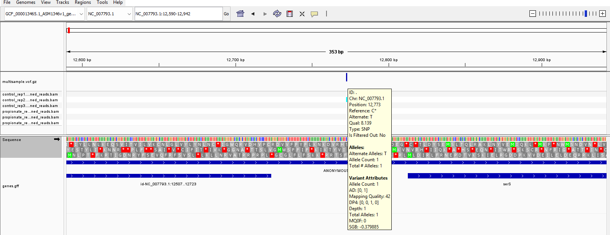

# Week 10 – Variant Effect Prediction

The only task this week was:

> **Evaluate the effects of at least 3 variants in your VCF file.**

## Tool choice

I chose to use SnpEff, as I’ve heard that Ensembl Variant Effect Predictor is generally better suited to eukaryotic genomes. Since I’m working with a bacterial genome (*S. aureus*), SnpEff felt like the more natural fit.

The lectures suggested these tools can be a bit fiddly, and that definitely matched my experience. After some trial and error, I updated my toolbox and Makefile so I could annotate my multisample VCF.

Once annotated, I explored variants via the CLI and then used Integrative Genomics Viewer (IGV) to visually confirm what I was seeing.

---

## Reproducibility

One thing I noticed is that this process isn’t fully reproducible in the strict sense the course sometimes aims for.

The issue is that I’m subsampling reads from the SRA (`N_READS`), so the exact variants I see depend on which reads get pulled. In principle, I could:

* download *all* reads, or
* enforce deterministic sampling

but neither feels in the spirit of the assignment.

That said, **the pipeline itself is reproducible**, even if the exact variants differ.

To rerun everything:

```bash
make REFERENCE_GENOME_READABLE_NAME=mrsa_465 get_and_index_reference_genome

make REFERENCE_GENOME_READABLE_NAME=mrsa_465 run_alignments_and_variants_workflow_for_samples_named_in_csv

make merge_vcfs

make REFERENCE_GENOME_READABLE_NAME=mrsa_465 annotate_multisample_vcf_with_snpeff
```

For the analysis below, I used:

```bash
N_READS=200000
```

---

## Variant analysis

### 1. Synonymous variant (LOW impact)

```bash
grep 'synonymous_variant' annotated_variants.vcf | head
```

```
NC_007793.1 18515 . T G ... ANN=G|synonymous_variant|LOW|
```



This shows a **GCT → GCG** codon change. Both code for alanine, so the amino acid sequence is unchanged.

This lines up with:

* the variant being labelled **LOW impact**, and
* the mutation occurring at the **third base of the codon**, where degeneracy is common.

Nothing surprising here.

---

### 2. Missense variant (MODERATE impact)

```bash
grep 'missense_variant' annotated_variants.vcf | head
```

```
NC_007793.1 5010 . C G ... ANN=G|missense_variant|MODERATE|
```



This changes:

* **CCT (Proline)** → **GCT (Alanine)**

So we go from proline to alanine. Proline is structurally quite unusual (rigid ring structure), whereas alanine is small and flexible.

My intuition is that this *could* affect protein structure/function, which fits the **MODERATE** label.

---

### 3. Stop gained (HIGH impact)

```bash
grep 'stop_gained' annotated_variants.vcf | head
```

```
NC_007793.1 269337 . A C ... ANN=C|stop_gained|HIGH|
```



This one is slightly subtle because the gene is on the **reverse strand**.

* Forward strand: A → C
* Reverse strand equivalent: T → G

This results in:

* **TTA (Leucine)** → **TGA (STOP)**

So this introduces a **premature stop codon**, truncating the protein.

This is correctly labelled **HIGH impact**, since it likely produces a non-functional protein.

---

### 4. Frameshift variant (HIGH impact)

```bash
grep 'frameshift_variant' annotated_variants.vcf | head
```

```
NC_007793.1 167891 . G GT ... ANN=GT|frameshift_variant|HIGH|
```



This is a **single nucleotide insertion**.

Because it’s not a multiple of 3, it shifts the reading frame downstream. That typically:

* changes every subsequent codon, and
* often introduces an early stop codon

So yeah — **“disaster” is a fair description**. High impact makes sense.

---

### 5. Upstream / modifier variant

```bash
grep 'MODIFIER' annotated_variants.vcf | grep -vE 'missense_variant|synonymous_variant|stop_gained|frameshift_variant' | head
```

```
NC_007793.1 12773 . C T ... ANN=T|upstream_gene_variant|MODIFIER|
```



This variant lies **outside a coding sequence**, upstream of a gene.

SnpEff labels this as **MODIFIER**, which generally means:

* no clear, direct impact on protein sequence
* but *possible* regulatory effects

One slightly confusing thing is that some variants *inside* genes can also get tagged as modifier in certain contexts. In bacteria, genomes are very compact:

* genes can overlap
* regulatory regions can sit very close to coding regions

So a base might be:

* inside one gene
* but upstream of another

This is why I had to use a more complex command here: to make sure I get something that's not part of a coding sequence.

---

## Summary

Across these examples, the SnpEff impact categories line up well with biological intuition:

| Variant type      | Impact   | Interpretation                      |
| ----------------- | -------- | ----------------------------------- |
| Synonymous        | LOW      | No amino acid change                |
| Missense          | MODERATE | Amino acid substitution             |
| Stop gained       | HIGH     | Premature termination               |
| Frameshift        | HIGH     | Disrupts entire downstream sequence |
| Upstream/modifier | MODIFIER | Possible regulatory effect          |

Using a combination of:

* CLI filtering
* SnpEff annotations
* IGV visual inspection

made it straightforward to sanity-check what was going on.
