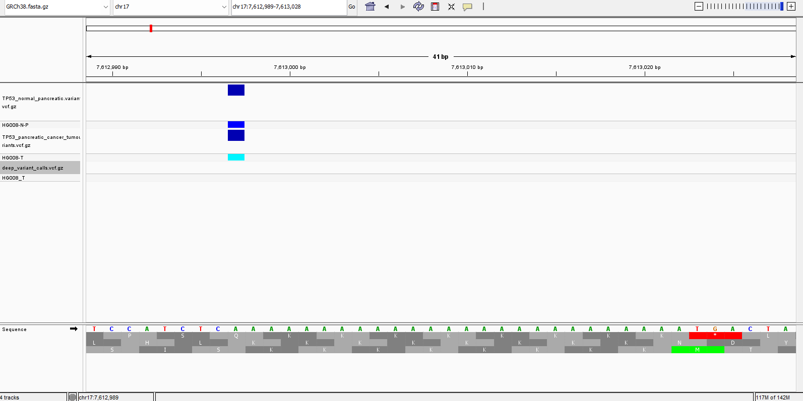
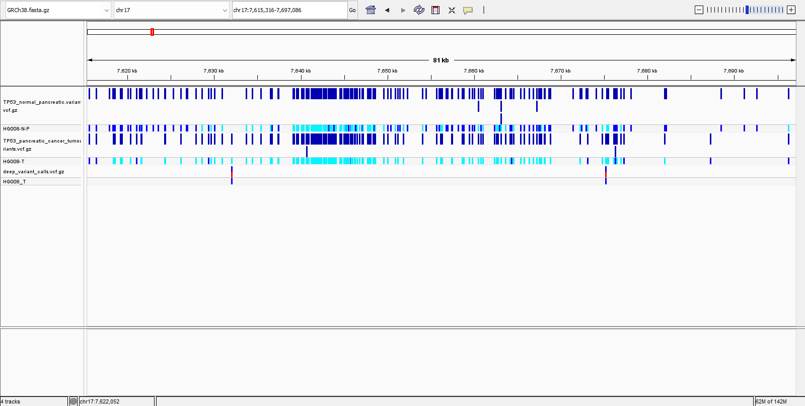

# Week 11 - Evaluating cancer variants

This week I went with option 2:

> Produce and evaluate variant calls  
> Generate variant calls from the Cancer Genome in a Bottle data and evaluate their quality.

The tasks were:

- call variants for normal and tumour samples in a region of interest
- compare variant calls between samples and identify tumour-specific variants
- compare my results to the gold standard DeepVariant calls, if available

If I learned one thing in this week’s work, it’s that it takes more than a week’s part-time work to properly sink one’s teeth into a project like this. There’s still a really large amount about GIAB and CGIAB that I don’t understand.

## Region of interest

First, I had to pick a region.

I picked **TP53**, because it’s related to a lot of cancers. It’s on chromosome 17, around 7.7 Mb.

## Workflow

My Makefile should replicate my workflow for this week’s work. To run it:

```bash
make all
````

I called variants by downloading the BAM files aligned around the TP53 region. I chose to work with the normal pancreatic cell line and the pancreatic cancer cell line.

There’s also a duodenal cell line. I guess the duodenum is near the pancreas, but I don’t really know why this is here, so I didn’t use it.

I then called variants with the variant caller in my toolbox that I made earlier in the course.

## Normal vs tumour calls

Looking across my variant calls in IGV, I was struck by there being clearly more variants called in the normal cell line than in the tumour cell line.

I’d have predicted the opposite, since I think of tumour cells as being “more mutated”. Also, the URLs of the BAM files indicate that the tumour BAM has greater coverage:

```text
tumour: 111x
normal: 70x
```

However, checking the coverage at the TP53 region in particular with a quick AI script, I got:

```text
normal_mean_depth = 74.34
tumour_mean_depth = 51.68
```

So although the tumour BAM has greater coverage overall, the normal cell line seems to have greater coverage in this region in particular.

I’m not certain this explains the discrepancy fully, but I’m happy with it for now. I suppose tumour cells might not really be “more mutated” in every possible region. They might just have particular mutations with significant effects.

## Tumour-specific variants

Scrolling through IGV and looking for variant calls that looked specific to the tumour cell line, I found 5 locations:

```text
7632049
7675217
7677313
7677340
7687289
```

Using `find_tumour_specific_variants` in my Makefile, I was surprised to find 20 “tumour-specific” variants.

I analysed the first 5 such variants that I didn’t spot by eye.

The first two were around a part of the genome that is just a lot of `A`s. Two of the next ones were around regions like:

```text
TAATAATAA...
```

or:

```text
TAAATAAAATAAAA...
```

I missed these in IGV, as the normal cell line also called variants in these rough areas, but sometimes a few nucleotides away.

I guess this makes sense, as I imagine repetitive regions are hard to map with confidence. So I expect these slight differences are due to uncertainty in alignment, rather than biology.

Example:



The last one I looked at was a variant called within a variant, which is of course easy to miss.

## DeepVariant comparison

I then got the variants called by DeepVariant.

I started asking myself what this DeepVariant thing is, what its inputs and outputs are, and how it works. I realised quickly that these questions are largely out of scope for this week’s work.

My basic understanding is that it’s a machine learning tool of some sort that replicates a human expert looking at a “high quality” variant and deciding that in this context, it’s not actually likely to represent an interesting or useful difference.

While GIAB is a gold standard pipeline of some sort, CGIAB doesn’t seem to have reached that level yet. I’m not confident that DeepVariant’s calls are a “ground truth”.

There were two variants called by DeepVariant in my region of interest.



Looking at the calls made by DeepVariant versus silly little me with my CLI and IGV, I guess DeepVariant has picked really high `QUAL` variant calls, above 200, and ones that aren’t in super repetitive regions.

Although maybe this is redundant, as repetitiveness could impact `QUAL`. I don’t fully know what `QUAL` is doing here yet.

See below for a high-quality variant called in agreement with DeepVariant:


## Summary

For this week, I called variants for normal and tumour samples around TP53, compared them, and then compared my calls with DeepVariant.

The main numbers I got were:

```text
Tumour-specific variants found by Makefile target: 20
Tumour-specific-looking locations spotted by eye in IGV: 5
DeepVariant calls in my region: 2
```

The biggest thing I’m taking from this is that “tumour-specific” is not as simple as it first sounds. Some variants are present in one VCF and not the other, but when I look at them in IGV, they may be in repetitive or awkward regions where I’m not confident they represent real biology.

This week felt like a useful first look at cancer variant calling, but definitely not like something I properly understand yet.

```
```

