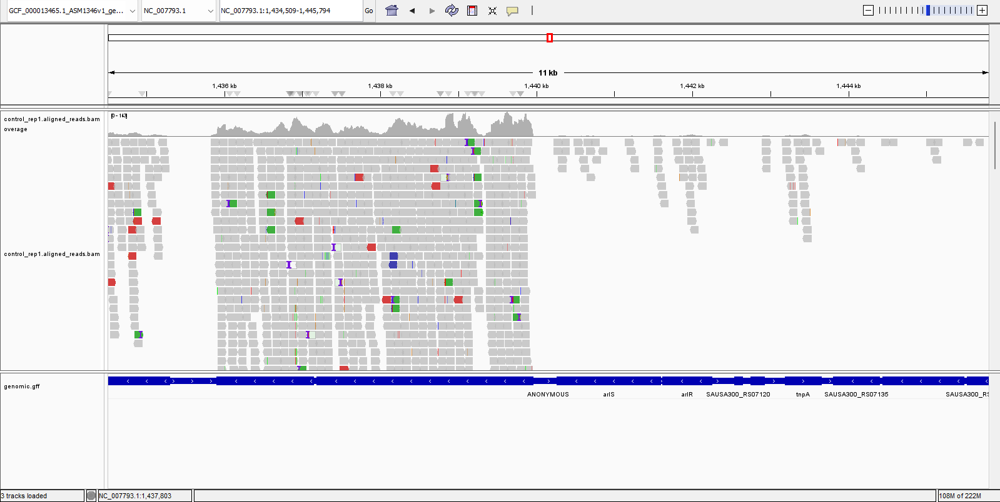
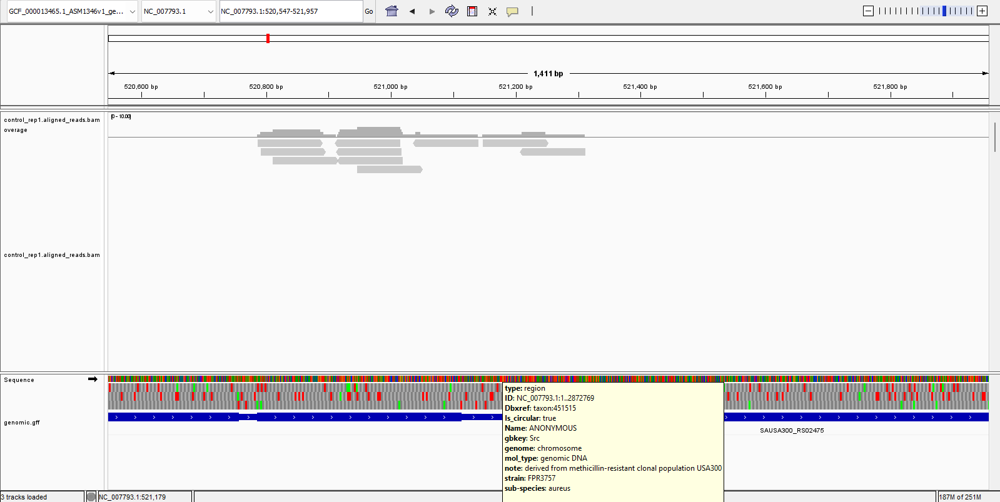
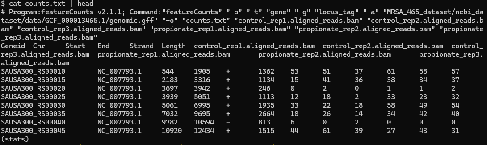
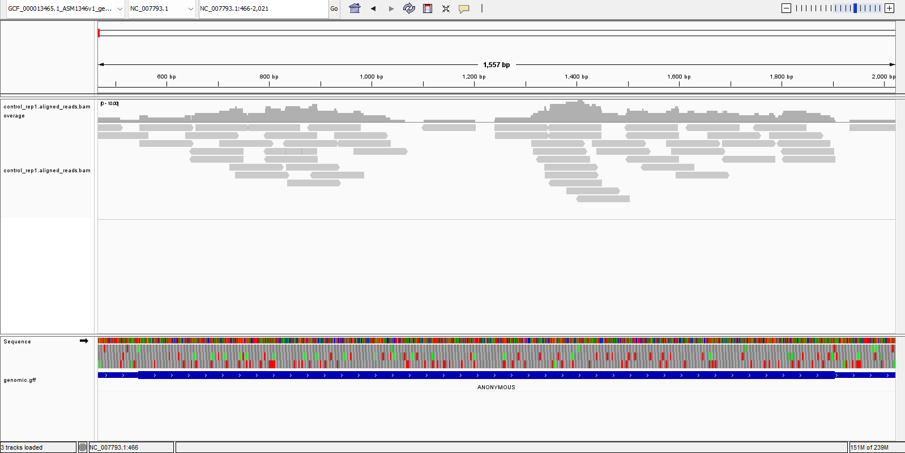
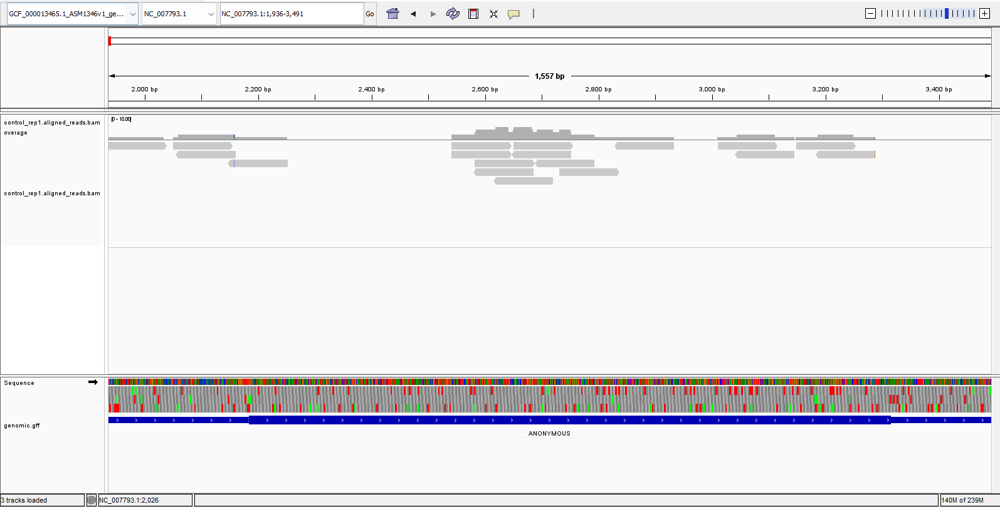
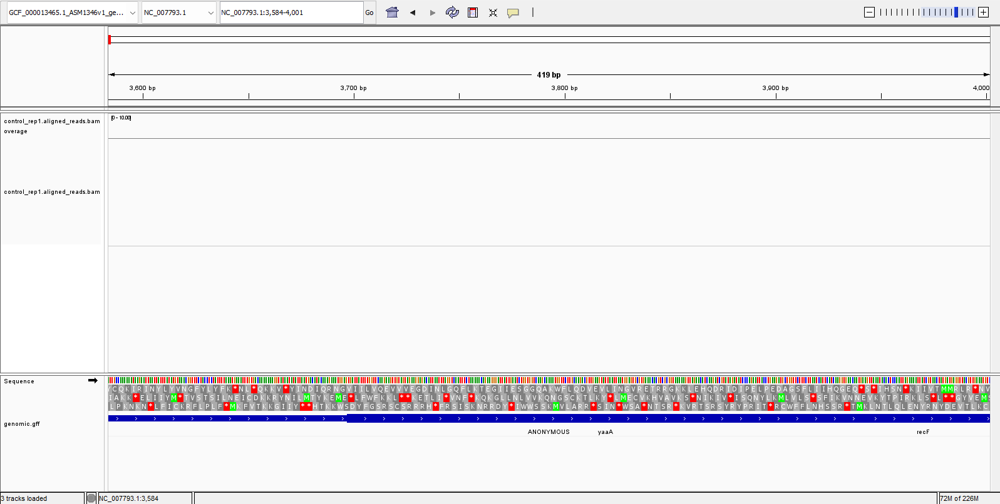
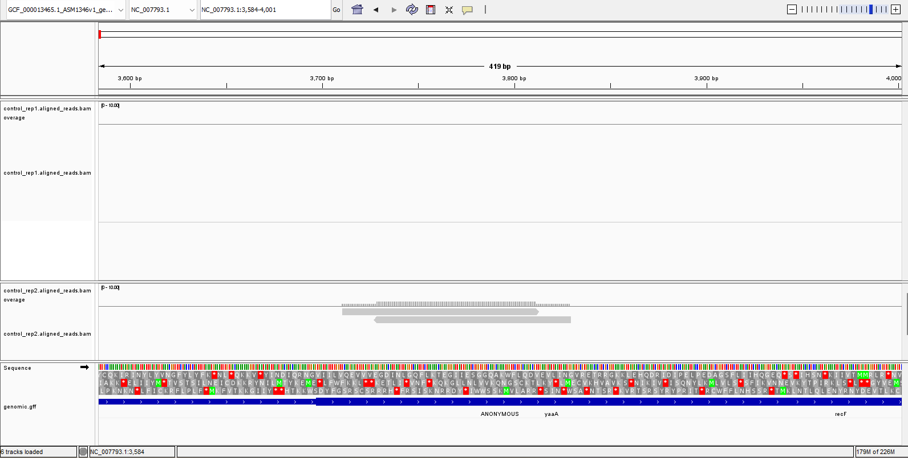

# Week 12: Genome-based RNA-Seq count matrix

## Overview

For this assignment, I used my **MRSA workflow from week 5**. It seems to tick all the boxes, so I stuck with the same data sources and the same overall workflow. I have very slightly changed my toolbox and Makefile now I’m slightly older and wiser.

The workflow uses:

- a **reference genome**
- a **GFF annotation file**
- **6 SRR datasets from the same project**
  - 3 control
  - 3 treatment

The submission includes:

- `README.md`
- `Makefile`
- a design file
- IGV screenshots supporting the count matrix values

To run the workflow, I just:

1. run `get_and_index_reference_genome`
2. run `run_workflow_for_samples_named_in_csv N_READS=100000`

---

## Generating the count matrix

To generate the count matrix, I ran:

```bash
featureCounts \
  -p \
  -t gene \
  -g locus_tag \
  -a MRSA_465_dataset/ncbi_dataset/data/GCF_000013465.1/genomic.gff \
  -o counts.txt \
  *.bam
````

This seemed to work fine.

### My understanding of the command

Big picture: this counts how many reads overlap each gene / feature (like rRNA, I guess). There are reasons to slow down here, some of which came up in the lectures. The number of reads aligning to a gene is obviously a fairly crude measure of gene activity, but it is still a measure.

### The flags

* `-p` says **paired-end**
* `-t gene` says **count against genes** rather than, presumably, exons, CDS regions, etc.
* `-g locus_tag` says **group by `locus_tag`**

My understanding is that `locus_tag` is one of the pieces of information attached to a gene in a GFF file. Presumably it reliably distinguishes genes, whereas gene names might be missing or reused.

* `-a` gives the **annotation file**
* `-o` gives the **output file**
* `*.bam` are the **read alignments** being counted

So overall, the command is: use the annotation to work out where the genes are, then count how many aligned reads overlap each one.

---

## IGV screenshots showing this is RNA-Seq data

I pulled up `control_rep1` in IGV and displayed it over the annotated genome. At a glance, it’s fairly clear that reads pile up over coding regions. The thinner lines at the bottom tend to be non-coding regions, and these also tend to be where we do **not** see reads.

If my organism were a eukaryote, I suppose this would be even clearer. I’d expect more non-coding regions, upstream/downstream regulatory regions, introns not showing up in mature mRNA, and all kinds of eukaryotic craziness.



There are, of course, regions that appear to be non-coding but still have a couple of reads over them. An example is below, and there are several others if you go looking.

I think there are a few possible explanations for this:

1. it could be rRNA or some other transcribed feature
2. the reads could be misaligned
3. the annotation may be incomplete
4. I expect this prokaryote to behave like a textbook prokaryote with a simple route from DNA to protein, but biology always has exceptions
5. some other unpredictable thing could be going on — contamination, a bit of DNA in the sample, imperfect transfer of data from lab to database, etc.

The point is that the overall trend — reads overlapping genes — is pretty strong, and I’m not too worried about the exceptions because there are several plausible reasons for each one.



---

## A few lines of the resulting count matrix

Here is the head of the count matrix:



The rows vary in how much variance they show, and the first row looks particularly consistent across replicates.

I also notice that shorter genes tend to have fewer hits. I’m not sure whether `featureCounts` is doing any normalisation here, but this suggests that it is **not**. If all genes were expressed at the same level, it would still be harder for a random fragment to overlap a short gene than a long one.

---

## Visual checks against IGV

I checked the first three genes in IGV to see whether the counts looked consistent with the alignment tracks.

### First gene

For the first gene, I’d expect a fair bit of expression.



Looks good.

### Second gene

For the second gene, I’d expect fewer reads.



Also looks reasonable.

### Third gene

For the third gene, I expected very few reads.



Absolutely none in replicate 1. At that point I remembered I was only looking at `rep1`. When I put `rep2` underneath it, I saw 2 reads, which is exactly what I’d expect from the count matrix.



So overall, the alignment tracks do appear to support the values observed in the count matrix.
