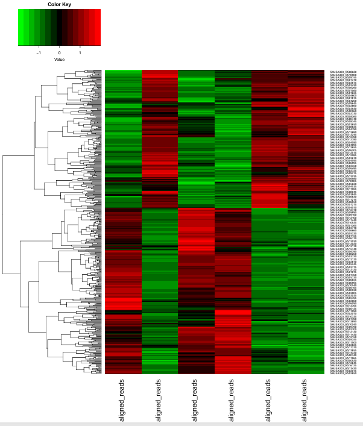
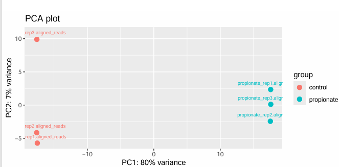
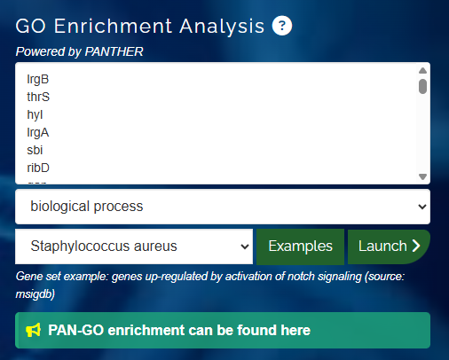
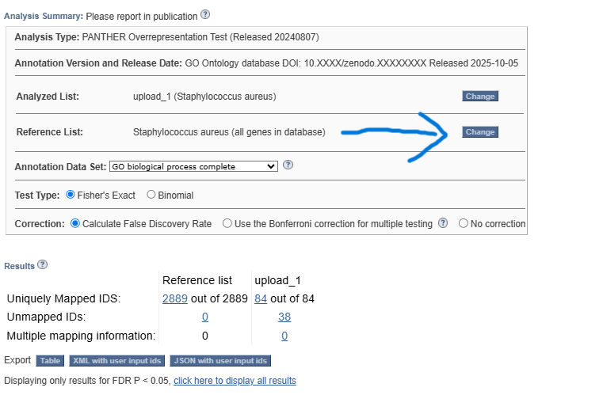
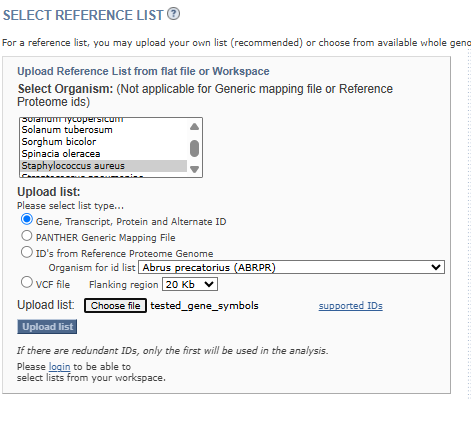
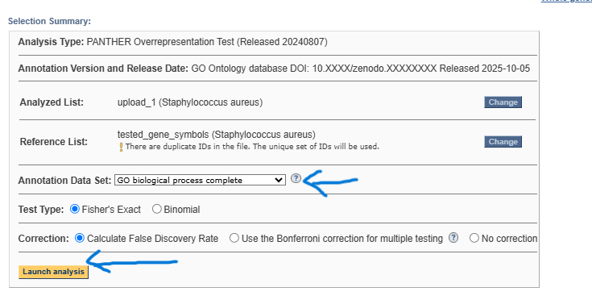
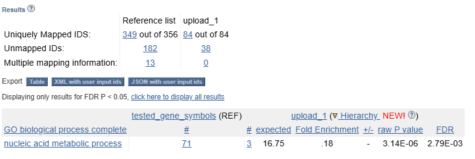
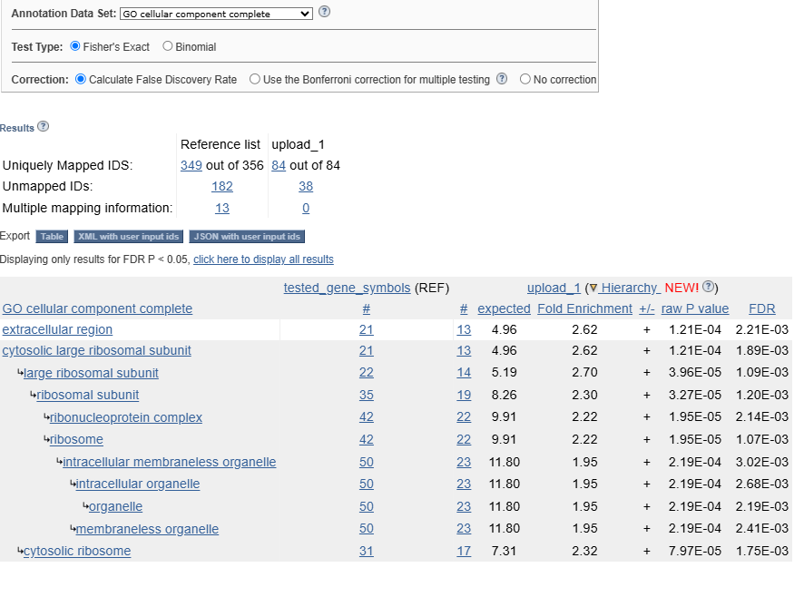
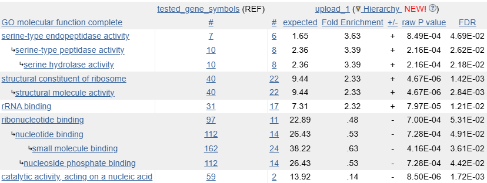

# Week 13: Differential Expression and Functional Enrichment

[Assignment: Perform a differential expression analysis on an RNA-Seq count matrix.]

In the same folder as this README are my `design.csv`, `Makefile`, and toolbox. Running the workflow will generate a list of candidate differentially expressed genes and the required plots.

## Workflow

My workflow is the following CLI commands:

```bash
micromamba activate bioinfo
bio code

make get_and_index_reference_genome
make run_workflow_for_samples_named_in_csv N_READS=100000
make get_featurecounts
````

This creates a count matrix from the aligned reads downloaded.

```bash
micromamba activate stats

make format_featurecounts
make stats
make plots
```

`make format_featurecounts` just makes the counts a CSV instead of a TXT.

`make stats` uses `edger` to actually test for differential expression.

`make plots` gets the PCA and heatmap.

## Plots



The labels have fallen off, but the controls are columns 1, 3, and 4, so the heatmap looks like the one in the tutorial. I must admit that I am not really sure what exactly the heatmap says.



The treatment groups are nice and separate.

## Functional enrichment

```bash
make gene_symbols
clip.exe < DE_gene_symbols
```

`make gene_symbols` converts the gene names used by `edger` to something PANTHER can understand. I pasted the output into [PANTHER](https://geneontology.org).



I then went to the reference list.



I put *Staphylococcus aureus* in as the organism and used `tested_gene_symbols` as the reference list.



I uploaded this and relaunched the analysis. I varied `Annotation Data Set` to get analyses of different, err, things.









## Results

Scanning the [paper I got the data from](https://www.frontiersin.org/journals/microbiology/articles/10.3389/fmicb.2022.1063650/full), they list “ribosome” as an enriched pathway, which makes me feel good about how often ribosome things are mentioned in the molecular-function and cellular-component results. It would be dishonest of me to say anything stronger about what my results mean or how likely they are to be valid or consistent with the paper.

This week’s work has left me with many more questions than answers, but I think I have already gone beyond what is expected for this week, so I will maybe come back to this later once I have finished the course.
