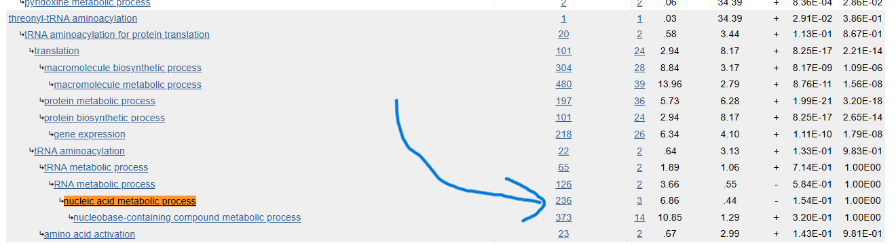
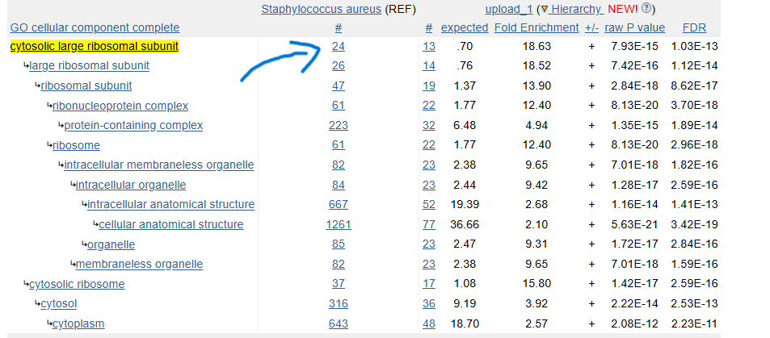
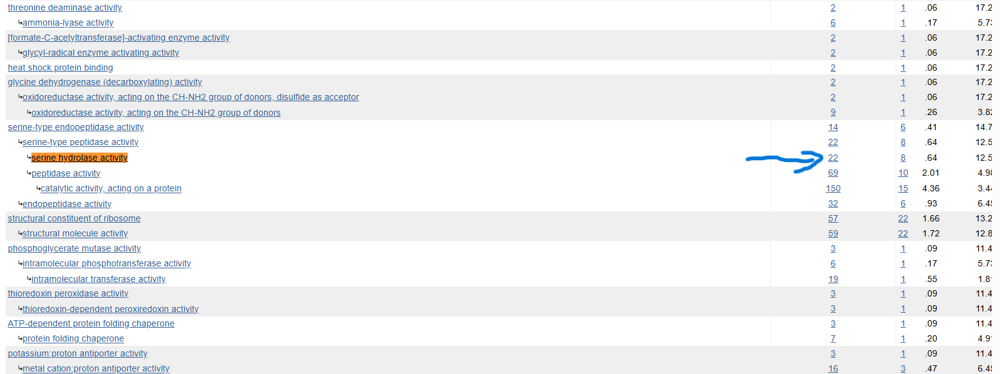

# Week 14: Ontologies

## Assignment

### Sequence Ontology

1. Choose a feature type from the GFF file and look up its definition in the Sequence Ontology.
2. Find both the parent terms and children nodes of the term.
3. Provide a short discussion of what you found.

### Gene Ontology

1. Identify a CC, MF, and BP term in the Gene Ontology relevant to your organism with a method of your choice.
2. Explain the term and show its parent terms and children nodes.
3. Find genes that are annotated with the term. List the genes.
4. Discuss how well the genome seems to be annotated and whether the terms you found are broad or narrowly specific.

Submit the link to the folder containing your script and the report.

---

# Sequence Ontology

Looking back at week two, I tried to understand some terms in the GFF of the Kestrel: “region = something vague that I doubt I should be worrying about at this stage”. This looks like a good candidate for something to learn more about.

```console
$ bio --download
$ bio explain region

## region (SO:0000001)

A sequence_feature with an extent greater than zero. A
nucleotide region is composed of bases and a polypeptide
region is composed of amino acids.

Parents:
- sequence_feature

Children:
- biomaterial_region
- experimental_feature
- biological_region
- topologically_defined_region

(bioinfo)
````

The parent and children are clearly listed, but the definition seems to kick the can down the road. To know what a region is, I need to know what a sequence feature is.

```console
$ bio explain sequence_feature

## sequence_feature (SO:0000110)

Any extent of continuous biological sequence.

Children:
- region
- junction
- sequence_comparison

(bioinfo)
```

Not as specific as I’d like. I’m not sure what “extent” or “biological sequence” mean. I guess I should take their meanings as I’d expect them: extent might be just a bit of something of any length, and biological sequence could be DNA, RNA, or protein of any kind and of any length. But the SO for `region` seems to imply you can have an “extent” of length 0.

This confusion seems to be cleared up through `region`’s, er, sister, `junction`.

```console
$ bio explain junction

## junction (SO:0000699)

A sequence_feature with an extent of zero.

Parents:
- sequence_feature

Children:
- clone_insert_end
- clone_insert_start
- exon_junction
- insertion_site
- polya_site
- deletion_junction
- chromosome_breakpoint
- splice_junction
- trans_splice_junction
- nucleotide_cleavage_site
- topologically_associated_domain_boundary

(bioinfo)
```

So this extent is between two residues, so it has length 0 but is still biologically relevant. Maybe an enzyme splices at a junction, for example.

---

# Gene Ontology

“Significant” things I found last week:

* Nucleic acid metabolic process - BP
* Cytosolic large ribosomal subunit - CC
* Serine hydrolase activity - MF

At a glance at the PANTHER results from last week, I notice a couple of things. First, PANTHER indentation gets broader as you go in, which is the opposite of what I think many people would expect. See how CC goes from a particular bit of a ribosome at the top to “organelle” at the bottom. Second, breadth/specificity can’t just be read off from the indentation, as I’d filtered for significant results, so insignificant things above or below a GO term are not shown.


I’m interpreting part 3, “Find genes that are annotated with the term. List the genes,” to be talking about the organism more broadly, rather than the genes I found to be significant or the genes that survived pre-processing. I therefore want to go back to last week’s PANTHER jobs and use the default *Staphylococcus aureus* genome, rather than my reference list of DE gene candidates.

I suppose there is no real reason to actually put my DE genes in, since I just want the reference. I assume there is a more direct way to get this information, but if it ain’t broke, don’t fix it. I’m not going to list all the genes, as there are sometimes hundreds of them for broad GO terms, but I’ll show how to get them, provide a link to see them, and discuss the relevance of the first gene listed.

## Biological Process: nucleic acid metabolic process

```console
$ bio explain nucleic acid metabolic process

## nucleic acid metabolic process (GO:0090304)

Any cellular metabolic process involving nucleic acids.

Parents:
- nucleobase-containing compound metabolic process
- macromolecule metabolic process

Children:
- dna metabolic process
- rna metabolic process
- nucleic acid biosynthetic process
- nucleic acid catabolic process

(bioinfo)
```

I suppose something might get tagged with “nucleic acid metabolic process” if it is involved in the making or breaking down of something to do with DNA or RNA. This is clearly quite a broad term.



[View the full PANTHER gene list for nucleic acid metabolic process](https://pantherdb.org/tools/gxIdsList.do?acc=GO:0090304&reflist=1)

The first gene on the list has a name: `Tryptophan--tRNA ligase`. This apparently sticks tryptophan on the corresponding tRNA for protein synthesis. It makes sense to me that this is a “nucleic acid metabolic process”, as the tRNA is a nucleic acid, and sticking a tryptophan residue to it is a metabolic (anabolic) process.

## Cellular Component: cytosolic large ribosomal subunit

```console
$ bio explain Cytosolic large ribosomal subunit

GO:0022625 cytosolic large ribosomal subunit
GO:0180023 cytosolic large ribosomal subunit assembly

(bioinfo)
```

The term I’m looking for is a substring of another term, hence two results. I’m impressed that the following works to resolve this ambiguity.

```console
$ bio explain GO:0022625

## cytosolic large ribosomal subunit (GO:0022625)

The large subunit of a ribosome located in the cytosol.

Parents:
- large ribosomal subunit
- cytosolic ribosome (part_of)

(bioinfo)
```

I suppose this term refers to a large ribosomal subunit located in the cytosol. This term looks very specific.



[View the full PANTHER gene list for cytosolic large ribosomal subunit](https://pantherdb.org/tools/gxIdsList.do?acc=GO:0022625&reflist=1)

The first gene is for `Large ribosomal subunit protein uL22`, which certainly looks like it belongs in the set of genes related to the cytosolic large ribosomal subunit.

## Molecular Function: serine hydrolase activity

```console
$ bio explain Serine hydrolase activity

GO:0017171 serine hydrolase activity
GO:0140292 adp-ribosylserine hydrolase activity

(bioinfo)

$ bio explain GO:0017171

## serine hydrolase activity (GO:0017171)

Catalysis of the hydrolysis of a substrate by a catalytic
mechanism that involves a catalytic triad consisting of a
serine nucleophile that is activated by a proton relay
involving an acidic residue (e.g. aspartate or glutamate)
and a basic residue (usually histidine).

Parents:
- hydrolase activity

Children:
- serine-type peptidase activity

(bioinfo)
```

Serine hydrolases look similar in name to serine proteases, but maybe they do not have to chop proteins in particular. Indeed, Wikipedia tells me serine proteases are a family of serine hydrolases. I suppose you get tagged with this if you have something to do with serine hydrolase activity.

This is quite a broad relationship to an enormous family of proteins, so I guess it is a relatively broad term.



[View the full PANTHER gene list for serine hydrolase activity](https://pantherdb.org/tools/gxIdsList.do?acc=GO:0017171&reflist=1)

The first gene is for `Serine protease HtrA-like`, which makes sense, as serine proteases are a type of serine hydrolase activity. I suppose this is sort of specific, but not super specific.

I am impressed with how well this genome seems to be annotated. The genes look like they belong to the GO terms, and there are lots of them, on the order of 100 for broad classes. It is kind of mind-blowing how much we know about the MRSA genome. It looks to me like no human could ever know all of this, so having all this information in free-to-access databases is essential and really quite cool.

---

# Relationship to Week 13

I didn’t really know what I was looking at with the functional-enrichment part of week 13’s assignment. Now I have a much clearer idea.

I talked about the three “things” I could click when running PANTHER: biological process, molecular function, and cellular component. I now know that these are sub-ontologies.

I’ve also thought a bit deeper about what my PANTHER results actually mean: a `-ve` in the `+/-` column means my DE’d genes were disproportionately unlikely to be connected to this GO term. In other words, this kind of process, component, or whatever probably is not the most important thing for explaining the effects of the treatment. I guess positive results are much more interesting.
