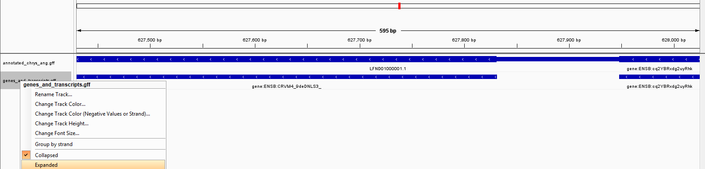
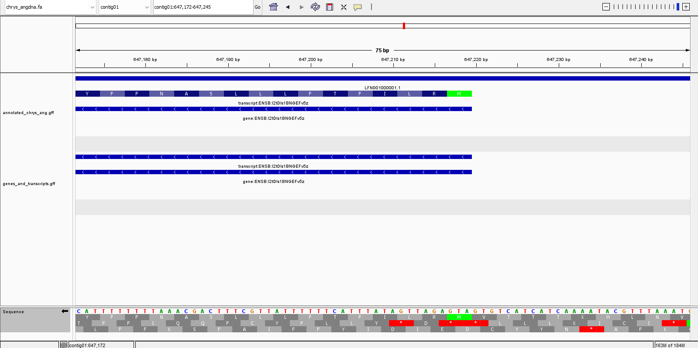
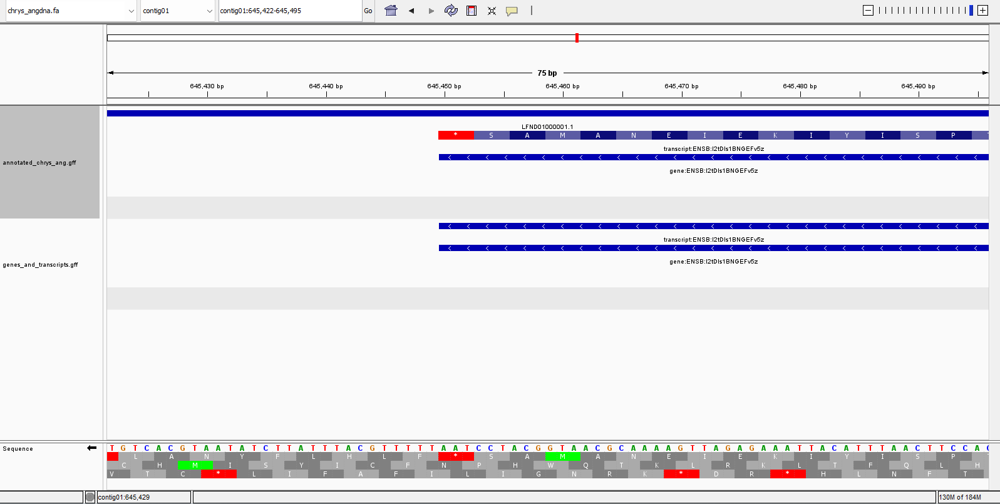

````markdown
# Week 3 Assignment: Genome Visualization and GFF Analysis

## Visualizing the Genome in IGV

We used IGV to visualize the genome of *Chryseobacterium angstadtii* along with its annotations.

```bash
$ wget https://ftp.ensemblgenomes.ebi.ac.uk/pub/bacteria/current/fasta/bacteria_1_collection/chryseobacterium_angstadtii_gca_001045465/dna/Chryseobacterium_angstadtii_gca_001045465.ASM104546v1_.dna.toplevel.fa.gz
$ gunzip Chryseobacterium_angstadtii_gca_001045465.ASM104546v1_.dna.toplevel.fa.gz
$ mv Chryseobacterium_angstadtii_gca_001045465.ASM104546v1_.dna.toplevel.fa chrys_angdna.fa
$ wget https://ftp.ensemblgenomes.ebi.ac.uk/pub/bacteria/current/gff3/bacteria_1_collection/chryseobacterium_angstadtii_gca_001045465/Chryseobacterium_angstadtii_gca_001045465.ASM104546v1.62.gff3.gz
$ gunzip Chryseobacterium_angstadtii_gca_001045465.ASM104546v1.62.gff3.gz
$ mv Chryseobacterium_angstadtii_gca_001045465.ASM104546v1.62.gff3 annotated_chrys_ang.gff
````

The genome and GFF annotations load successfully in IGV. Screenshots for later tasks demonstrate the visualization.

---

## Genome Size and Feature Counts

We calculated the genome size and examined the number of features in the GFF file.

```bash
$ seqkit stats chrys_angdna.fa
file             format  type  num_seqs    sum_len  min_len    avg_len    max_len
chrys_angdna.fa  FASTA   DNA         11  5,202,773    9,792  472,979.4  1,224,030
```

The 11 sequences correspond to what can be seen in IGV.

```bash
$ grep -v ">" chrys_angdna.fa | wc -c
5289492

$ grep -v ">" chrys_angdna.fa | tr -d '\n' | wc -c
5202773
```

The discrepancy is due to newline characters; after removing them, the count matches the sum length reported by `seqkit`.

---

## Extracting Gene and Transcript Intervals

To simplify analysis, we separated intervals of type `gene` or `mRNA` into a separate GFF file:

```bash
$ grep -v "^#" annotated_chrys_ang.gff | awk '$3=="gene" || $3=="mRNA"' > genes_and_transcripts.gff
```

---

## Comparing Original and Simplified GFF in IGV

The simplified GFF was loaded as a separate track in IGV.



Since the prokaryotic genome is relatively simple, simplifying the GFF does not change the visualization much. Only a small visual difference is visible in the "collapsed" view.

---

## Sequence Orientation and Translation Table

By zooming in, we verified the sequence orientation and examined the translation table in IGV. It is important that the translation table is displayed in the correct orientation to interpret the coding sequences correctly.

* Incorrect orientation: 
* Correct orientation: 

---

## Start and Stop Codon Verification

We visually confirmed that coding sequences begin with a start codon and end with a stop codon:

* Start codon verification: see correct orientation image above.
* Stop codon verification: 

This ensures that the gene models in the GFF file correctly correspond to actual coding sequences.
