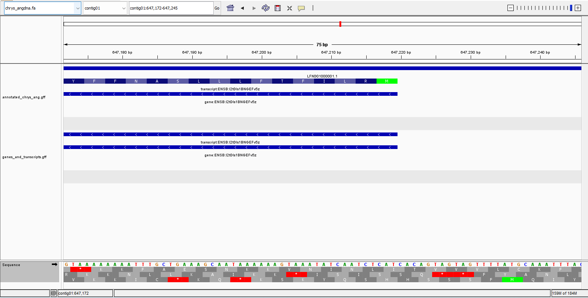

# Week 3 Assignment: Genome Visualization and GFF Analysis

## Visualizing the Genome in IGV

I used IGV to visualize the genome of *Chryseobacterium angstadtii* along with its annotations.

```bash
$ wget https://ftp.ensemblgenomes.ebi.ac.uk/pub/bacteria/current/fasta/bacteria_1_collection/chryseobacterium_angstadtii_gca_001045465/dna/Chryseobacterium_angstadtii_gca_001045465.ASM104546v1_.dna.toplevel.fa.gz
$ gunzip Chryseobacterium_angstadtii_gca_001045465.ASM104546v1_.dna.toplevel.fa.gz
$ mv Chryseobacterium_angstadtii_gca_001045465.ASM104546v1_.dna.toplevel.fa chrys_angdna.fa
$ wget https://ftp.ensemblgenomes.ebi.ac.uk/pub/bacteria/current/gff3/bacteria_1_collection/chryseobacterium_angstadtii_gca_001045465/Chryseobacterium_angstadtii_gca_001045465.ASM104546v1.62.gff3.gz
$ gunzip Chryseobacterium_angstadtii_gca_001045465.ASM104546v1.62.gff3.gz
$ mv Chryseobacterium_angstadtii_gca_001045465.ASM104546v1.62.gff3 annotated_chrys_ang.gff
```

The genome and GFF annotations loaded into IGV without any issues. The screenshots later on show what this looks like.

---

## Genome Size and Feature Counts

First, I checked the genome size:

```bash
$ seqkit stats chrys_angdna.fa
file             format  type  num_seqs    sum_len  min_len    avg_len    max_len
chrys_angdna.fa  FASTA   DNA         11  5,202,773    9,792  472,979.4  1,224,030
```

There are 11 sequences, which matches what I see in IGV.

I also double-checked the total length manually:

```bash
$ grep -v ">" chrys_angdna.fa | wc -c
5289492

$ grep -v ">" chrys_angdna.fa | tr -d '\n' | wc -c
5202773
```

The difference is just newline characters—once removed, the total matches the `seqkit` output (5,202,773 bp).

Next, I counted feature types in the GFF file:

```bash
$ grep -v '^#' annotated_chrys_ang.gff | cut -f 3 | sort | uniq -c | sort -rn
   4592 exon
   4549 mRNA
   4549 gene
   4549 CDS
     43 ncRNA_gene
     43 ncRNA
     11 region
```

A couple of quick observations:

* The counts for `gene`, `mRNA`, and `CDS` are identical (4549), which is what I’d expect for a fairly clean prokaryotic annotation.
* There are slightly more `exon` features than genes, which I don't understand.
* The 11 `region` entries line up with the 11 sequences in the genome.
---

## Extracting Gene and Transcript Intervals

To make things a bit simpler, I pulled out just the `gene` and `mRNA` entries into a separate file:

```bash
$ grep -v "^#" annotated_chrys_ang.gff | awk '$3=="gene" || $3=="mRNA"' > genes_and_transcripts.gff
```

---

## Comparing Original and Simplified GFF in IGV

I loaded this simplified GFF as a separate track in IGV.


Since this is a prokaryotic genome, things are already pretty simple, so removing other feature types doesn’t change the view much. There’s a slight difference when tracks are collapsed, but nothing major.

---

## Sequence Orientation and Translation Table

Zooming in, I checked the sequence orientation and looked at the translation table in IGV.

Getting the orientation right matters—otherwise the coding sequences don’t make sense.

* Incorrect orientation: 
* Correct orientation: 

---
