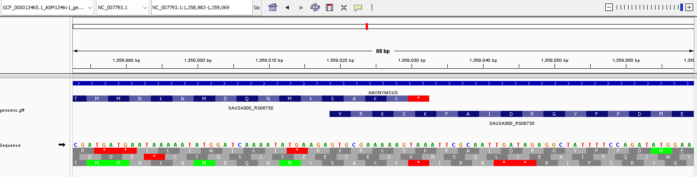
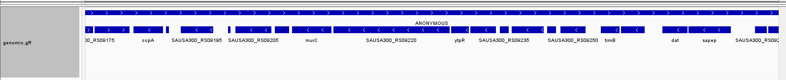
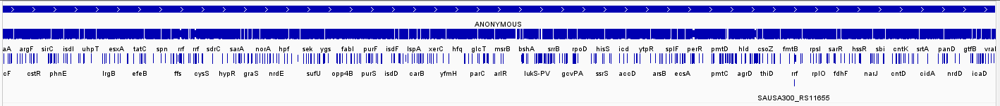

# Week 4 Report

## Group Assignment
I have been assigned to **Group 3**.

---

## Data Retrieval

**Identify the accession numbers for the genome referenced in your assigned paper.**  

The paper is available at [Frontiers in Microbiology](https://www.frontiersin.org/journals/microbiology/articles/10.3389/fmicb.2022.1063650/full). It states:  

> “The raw data associated with this study are accessible through the NCBI Sequence Read Archive (SRA) database under BioProject ID PRJNA887926.”

It took me a while to understand what all these IDs mean:

- **PRJNA887926** points to the paper (PRoJect).  
- **NC_007793.1** points to a singular chromosome of the bacterium used as the reference for RNA-seq in the paper:  

> “Furthermore, we found that 99.48–99.64% of the clean reads were successfully aligned to the reference genome of *S. aureus* subsp. *aureus* USA300_FPR3757 (NCBI Reference Sequence: NC_007793.1).”

Why give one sequence ID for a whole reference genome? Because there is only one chromosome. Plasmids and other elements exist but I will not focus on them for now.  

- **GCF_000013465.1** is the full genome, which is mainly the above chromosome. Searching the chromosome ID in NCBI points to this assembly.

**Download the genome and annotation data (reproducible commands):**

```bash
$ datasets download genome accession GCF_000013465.1 --include gff3,genome
$ unzip -n ncbi_dataset.zip
$ cd ncbi_dataset/data/GCF_000013465.1
$ ls
GCF_000013465.1_ASM1346v1_genomic.fna  genomic.gff
````

---

## Visualization

I used IGV to visualize the genome and annotations (GFF file).


This image shows the start codon peculiarity. Sometimes bacteria use **GTG** instead of **ATG** as a start codon. This may still translate to Methionine (M), but IGV might show it as Valine (V) if assuming the standard genetic code.

---

## Data Evaluation

**Determine the genome size and count the number of features in the GFF file.**

```bash
$ seqkit stats GCF_000013465.1_ASM1346v1_genomic.fna
file                                   format  type  num_seqs    sum_len  min_len    avg_len    max_len
GCF_000013465.1_ASM1346v1_genomic.fna  FASTA   DNA          4  2,917,469    3,125  729,367.3  2,872,769
```

* **Genome size:** 2,917,469 bp

```bash
$ grep -v "#" genomic.gff | cut -f3 | sort-uniq-count-rank
2858    CDS
2846    gene
82      pseudogene
72      exon
52      tRNA
16      rRNA
13      riboswitch
4       region
3       binding_site
3       sequence_feature
1       ncRNA
1       RNase_P_RNA
1       SRP_RNA
1       tmRNA
```

---

## Gene Identification

**Identify the longest gene.**

```bash
$ grep -v "^#" genomic.gff | awk '$3=="gene" {print $9, $5-$4, $5}' | sort -k2 -nr | head
ID=gene-SAUSA300_RS07235;Name=ebh;gbkey=Gene;gene=ebh;gene_biotype=protein_coding;locus_tag=SAUSA300_RS07235;old_locus_tag=SAUSA300_1327 31265 1488076
```

* **Name:** `ebh`
* **Function:** This protein is attached to the bacterial cell wall. It partly contributes to structural integrity but mainly interacts with the bacterium’s environment, including the extracellular matrix (ECM). This likely plays a role in its activity in host organisms.

**Pick another gene.**

```bash
$ grep "hysA" genomic.gff
NC_007793.1     RefSeq  gene    2338092 2340515 .       +       .       ID=gene-SAUSA300_RS11915;Name=hysA;gbkey=Gene;gene=hysA;gene_biotype=protein_coding;locus_tag=SAUSA300_RS11915;old_locus_tag=SAUSA300_2161
NC_007793.1     Protein Homology        CDS     2338092 2340515 .       +       0   ID=cds-WP_000222239.1;Parent=gene-SAUSA300_RS11915;Dbxref=GenBank:WP_000222239.1;Name=WP_000222239.1;gbkey=CDS;gene=hysA;inference=COORDINATES: similar to AA sequence:RefSeq:YP_500931.1;locus_tag=SAUSA300_RS11915;product=hyaluronate lyase HysA;protein_id=WP_000222239.1;transl_table=11
```

* **Function:** Hyaluronate lyase cleaves hyaluronate, a glycosaminoglycan in connective tissue. This may facilitate bacterial movement through host tissues, similar to cutting a hole in a net.

---

## Genomic Feature Distribution

**Examine the distribution of genomic features:**

This is effectively captured by the CDS coverage.

**Estimate proportion of genome covered by coding sequences (using IGV):**




* Coverage looks like ~85% zoomed in. The higher value when zoomed out (~99%) is likely a resolution issue.

---

## Alternative Genome Builds

**Find alternative genome builds for *S. aureus*:**

* `GCF_002895385.1`
* `GCF_037039295.1`

There are many builds available.

**Discuss questions that could be answered using a different genome build:**

The build in the paper is MRSA. Using a Methicillin-sensitive strain could allow me to ask whether the findings from this paper apply to other genomes or are specific to this one. Many alternative builds are more recent (the one in the paper is from 2006), so I could compare results across time and strain differences.
