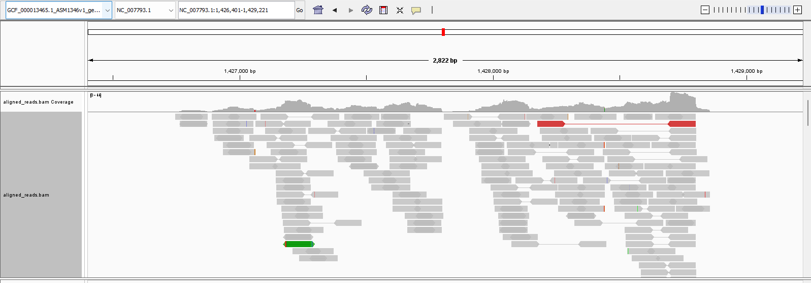
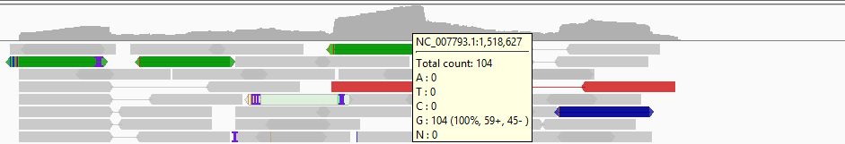

# Week 6: Short Read Alignment and BAM Analysis

## Overview

This week builds directly on the bash script from the previous assignment. The task was to convert that workflow into a Makefile and extend it to include alignment, indexing, and basic analysis of sequencing data.

When I first read the task, my instinct was: *surely there’s an easy way to just run part of my bash script*. It turns out this is exactly the kind of problem Makefiles are designed to solve. In hindsight, it’s a nice bit of pedagogy—make it slightly painful first, then introduce the proper tool.

That said, I don’t think the goal here is a literal one-to-one translation from bash to Make. In practice, you’d choose one approach from the start. Some parts of my original script didn’t make sense to carry over, so I focused on translating the core steps into Make targets.

---

## Makefile Usage

The Makefile defines a series of targets that represent each stage of the workflow. Instead of running a long script, I can now execute individual steps or chain them together:

* `make genome` → download the reference genome
* `make reads` → download sequencing reads from SRA
* `make index` → build the genome index
* `make align` → align reads and produce a SAM file
* `make bam` → convert and sort to BAM
* `make bam_index` → index the BAM file
* `make bam_stats` → generate alignment statistics

This modular structure makes it much easier to rerun only the parts that need updating.

---

## Alignment Strategy

One of the decisions was which aligner to use.

The course flowchart suggests using RNA-seq–specific tools when working with transcripts. However, this matters much more for eukaryotic genomes where splicing (introns/exons) is a factor. Since I’m working with *MRSA* (a prokaryote), transcripts correspond directly to coding regions, so a standard genomic aligner is appropriate.

I briefly considered whether RNA sequencing would introduce complications due to uracil (U) instead of thymine (T), but since sequencing is performed on cDNA, this isn’t an issue.

I chose **bowtie2**. The notes mention it performs well when reads may map to multiple locations, which is relevant here because I already observed repetitive regions in the genome last week.

---

## BAM Visualisation (IGV)



The most obvious feature in the IGV view is the uneven stacking of reads across the genome. Certain regions have very high coverage, while others have little to none.

This makes sense in the context of RNA-seq: highly expressed genes produce more transcripts, so they appear as dense piles of reads. Still, I expected the distribution to be even more skewed than what I observed.

The assignment also mentions simulated reads, which I don’t remember generating earlier. I’ve ignored that for now but flagged it as something to revisit.

---

## Alignment Statistics

I generated alignment statistics using `samtools flagstat` and calculated coverage using:

```bash
samtools depth -a $(BAM) | awk '{sum+=$$3} END {print "Average coverage: ", sum/NR}'
```

A couple of important details here:

* `samtools depth` without `-a` only reports positions with coverage, which inflates the average.
* Using `-a` ensures positions with zero coverage are included.
* In a Makefile, `$3` must be written as `$$3` to avoid being interpreted by Make.

### Results

* **Percentage of reads aligned:** 99.59%
* **Expected coverage:** ~10× (by design from Week 5)
* **Observed coverage:** ~10.5×

The observed value is very close to expectation once zero-coverage positions are included.

---

## Coverage Variation



Coverage varies substantially across the genome:

* Many regions have **zero coverage**
* Some regions exceed **100× coverage**

This is consistent with RNA-seq data, where expression levels differ widely between genes.

---

## Reflections and Improvements

A few things I’d like to explore further:

* I used bowtie2 because it’s common, recommended in the notes, and handles repetitive regions reasonably well. However, tools like **bwa** and **minimap2** are also widely used. It would be useful to rerun the pipeline with these and compare results.

* The assignment references simulated reads, which I don’t recall generating. I should check earlier materials and, if necessary, generate them myself.

* Mapping quality scores in the SAM/BAM files look interesting. I’d like to better understand how alignment confidence is quantified, especially in repetitive regions.

* I’ve probably only scratched the surface of what IGV can show. The course notes suggest it takes 20–30 datasets before patterns become intuitive, so this is something to revisit with more experience.
