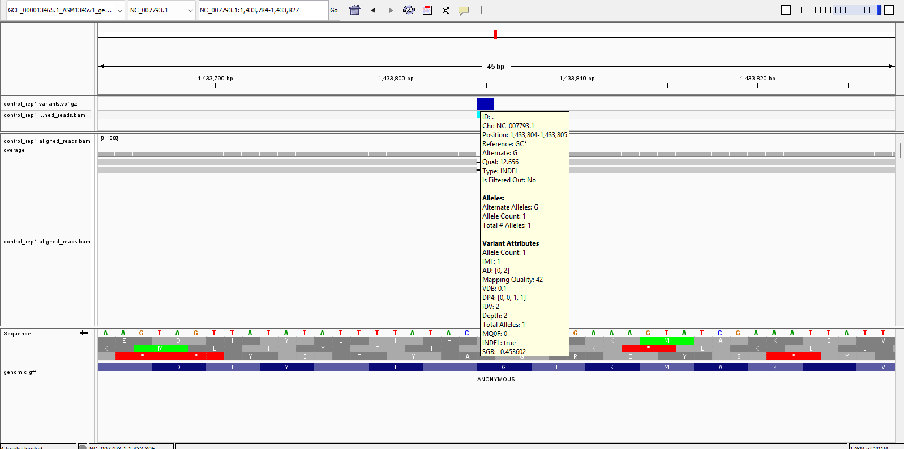
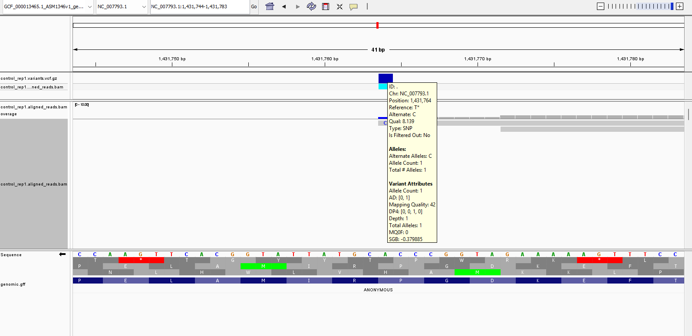
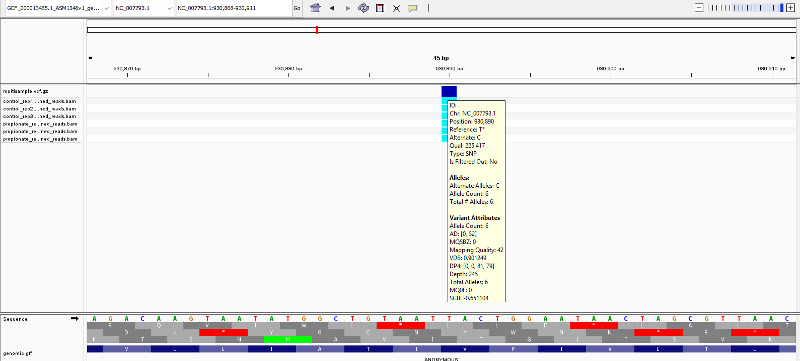
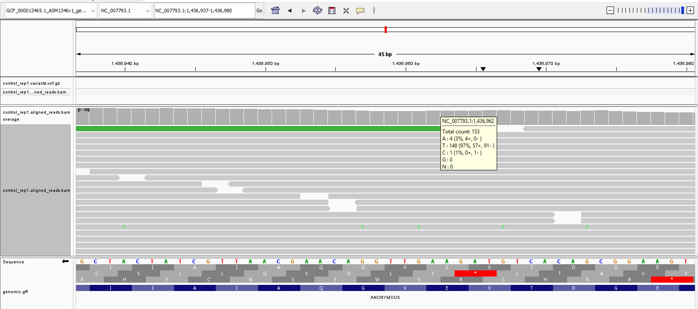
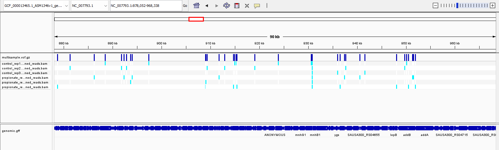

# Week 9 Assignment: Variant Calling Pipeline

This assignment extends my previous alignment pipeline to include variant calling. As before, everything is driven by a Makefile, with a `README.md` and `design.csv` included in the repository.

---

## Overview

The goal here was to:

* Call variants on a single sample using an existing BAM file
* Scale this up to multiple samples
* Produce and inspect a multisample VCF

I added:

* **Step 9:** call variants
* **Step 10:** index variants

to my main Makefile, and created a new module:

* `variant_calling.mk` in my toolbox

---

## Calling Variants on a Single Sample

I extended my pipeline to take an existing BAM file and produce a compressed VCF:

* Input: aligned BAM
* Output: `.vcf.gz` + index

This is done using a standard `bcftools` pipeline:

* `mpileup` → summarise evidence at each position
* `call` → identify candidate variants
* `norm` → normalise representation
* `sort` → produce final compressed VCF

---

## Best Practices (and What I Don’t Fully Get Yet)

I used the flags suggested in the course materials. I don’t fully understand all of them yet, so I dug into a few that stood out.

### `-d 100` in `mpileup`

This limits the maximum read depth per position to 100.

I find this a bit counterintuitive. If I’ve downloaded the reads, why throw data away? Especially in highly expressed genes, I’d expect depth >>100.

Apparently this helps avoid:

* excessive memory usage
* bias from extremely high coverage

The “bias” part is interesting — I’d like to understand exactly what goes wrong if this cap isn’t used.

---

### Strand Bias Annotations

Some annotations relate to strand bias, which I hadn’t encountered before.

Given DNA is double-stranded and complementary, I would have expected symmetry. So the idea that variants might appear preferentially on one strand is surprising.

---

### `-m` and `-v` in `bcftools call`

* `-m`: multiallelic caller
* `-v`: output variants only

The `-v` flag feels strange at first — why would a variant caller output non-variants?

I think the underlying model evaluates every position, and this flag just filters to sites where variation is detected.

---

### `-d all` in `bcftools norm`

This removes duplicate variants.

My initial thought was that repeated variants = strong evidence, but this is likely about removing duplicated representations of the *same* variant rather than biological repetition.

---

### Why Multiple Commands?

The pipeline is split across:

* `mpileup`
* `call`
* `norm`
* `sort`

It feels like it could be one command, but this modular setup probably improves control and transparency.

---

## Visualising the Single-Sample VCF in IGV

After loading `control_rep1` into IGV, I made the following observations.

### Indels That Break Reading Frames

Lots of indels where length ≠ 0 mod 3.

These would cause frameshifts in coding regions, which should be catastrophic if real → suggests many are false positives.



---

### SNPs with Depth = 1

Many variant calls are supported by a single read.

My interpretation:

* 1 read disagrees with the reference
* 0 reads support the reference
* passes some threshold

I don’t trust these much.



---

### More Convincing Calls

Looking at the highest-depth variants:

```bash
bcftools query -f '%CHROM\t%POS\t%DP\n' multisample.vcf.gz | sort -k3,3nr | head
```

Top results:

```
NC_007793.1     930890  245
NC_007793.1     593858  242
NC_007793.1     1872844 196
...
```

Inspecting these in IGV looks much more convincing — lots of consistent supporting reads.



---

### “No Calls” Despite Some Variation

I also see positions where:

* most reads match the reference
* a small fraction (<5%) show a SNP
* no variant is called

This supports the idea of a statistical threshold being applied.



---

## Running the Pipeline for One Sample

To run the workflow:

```bash
make workflow_for_one_sample SRR=SRR21835896 SAMPLE=your_sample_name
```

Requirements:

* Reference genome downloaded and indexed
* Optional:

  ```bash
  REFERENCE_GENOME_READABLE_NAME=...
  ```

---

## Running Variant Calling for All Samples

I handled iteration inside Make:

```bash
make run_workflow_for_samples_named_in_csv N_READS=200000
```

* Reads from `design.csv`
* Runs full pipeline per sample

Runtime: ~5 minutes on my machine.

---

## Creating a Multisample VCF

I merged individual VCFs using:

```bash
bcftools merge
```

---

## Visualising the Multisample VCF

In IGV:

* light blue = variants per sample
* dark blue (top) = combined signal

My interpretation is that the top track is effectively the union across samples.



---

## Quality Control Across Samples

### Alignment Quality

From `bam_stats.txt`:

* high mapping rates
* good properly paired percentages

No issues at a glance.

---

### Variant Counts

```bash
bcftools view -H sample.variants.vcf.gz | wc -l
```

All 6 samples:

* ~200 variants each

---

### Coverage

I used a large `N_READS`, so coverage is good.

But since this is RNA-seq:

* not all genes are expressed
* full genome coverage isn’t expected

---

## Final Thoughts

The pipeline works end-to-end, but raises a few questions:

* What exactly determines variant calling thresholds?
* How unreliable are low-depth variants in practice?
* What biases are being corrected for (strand bias, depth caps, etc.)?

For now, I trust high-depth, consistent calls far more than anything else.
